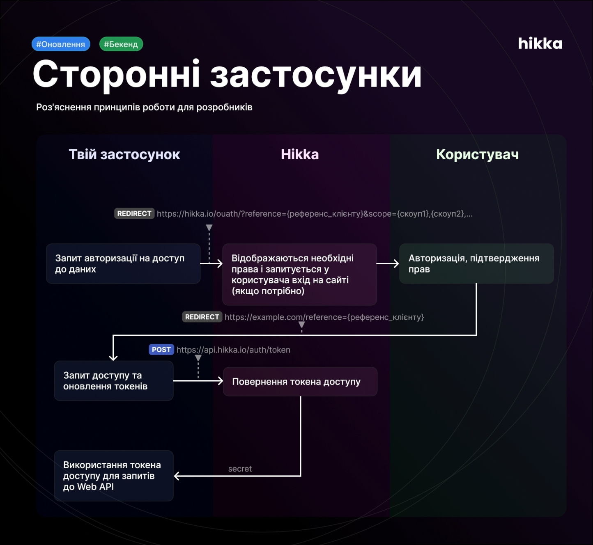

# Інтеграція авторизації через **Hikka** для вашого проєкту

Цей документ описує, як підключити авторизацію в ваш застосунок, використовуючи **Hikka** як провайдера ідентичності (third-party login).



---

## 🧭 Огляд потоку

1. **Клієнтський редірект на Hikka**
   Ви формуєте лінк на сторінку згоди Hikka і перенаправляєте користувача.
2. **Hikka → ваш `redirect_uri`**
   Після згоди Hikka викликає ваш `redirect_uri` і передає `reference` (alias `request_reference`) у query.
3. **Обмін `reference` → `secret`**
   Ваш бекенд викликає `POST /auth/token` з `request_reference` і вашим `client_secret`. У відповіді приходить **секрет** (third-party токен).
4. **Отримання профілю користувача**
   Далі ви звертаєтесь до `GET /user/me` з заголовком `Auth: <secret>` і отримуєте дані користувача.
5. **(Опційно) відкликання токена**
   `DELETE /auth/token/{token_reference}`.

---

## 🔑 Терміни

* **client\_reference** — ідентифікатор вашого клієнта в Hikka (видається Hikka).
* **client\_secret** — секрет вашого клієнта, **зберігається тільки на бекенді**.
* **reference / request\_reference** — короткочасний код, який Hikka повертає на ваш `redirect_uri` після згоди користувача.
* **secret** — токен, яким ви підписуєте запити до Hikka (заголовок `Auth: <secret>`).
* **token\_reference** — ідентифікатор виданого токена (знадобиться для відкликання).

---

## 📦 Залежності / змінні оточення

Зручно покласти конфіг у змінні оточення:

```
HIKKA_CLIENT_REFERENCE=xxxxxxxx-xxxx-xxxx-xxxx-xxxxxxxxxxxx
HIKKA_CLIENT_SECRET=your_hikka_client_secret
```

Для прикладів нижче потрібна лише бібліотека `requests`.

---

## 🔗 Крок 1. Згенерувати URL згоди

**Ендпоінт (front):**

```
GET https://hikka.io/oauth
```

**Query параметри (типові):**

* `reference` — ваш `client_reference`
* `scope` — кома-сепарований список (необов’язково)

**Приклад URL:**

```
https://hikka.io/oauth?client=YOUR_CLIENT_REFERENCE&scope=read:user-details,read:watchlist
```

---

## ↩️ Крок 2. Прийняти `reference`

Після згоди Hikka викличе ваш endpoint` з query-параметром:

```
https://your.app/auth/hikka?reference=REQUEST_REFERENCE
```

Збережіть `reference`.

---

## 🔁 Крок 3. Обміняти `reference` на `secret`

**Ендпоінт (API):**

```
POST https://api.hikka.io/auth/token
```

**Тіло запиту (JSON):**

```json
{
  "request_reference": "REQUEST_REFERENCE",
  "client_secret": "YOUR_CLIENT_SECRET"
}
```

**Очікувана відповідь (приклад):**

```json
{
  "secret": "SECRET_FOR_AUTH_HEADER",
  "token_reference": "tok_12345",
  "expires_in": 3600,
  "scope": "read:user-details,read:watchlist"
}
```

---

## 👤 Крок 4. Отримати профіль користувача

**Ендпоінт (API):**

```
GET https://api.hikka.io/user/me
```

**Заголовок:**

```
Auth: SECRET_FOR_AUTH_HEADER
```

**Приклад відповіді (реальний з вашого середовища):**

```json
{
  "reference": "",
  "updated": 1756282464,
  "created": 1712125598,
  "description": null,
  "username": "",
  "cover": null,
  "active": true,
  "avatar": "https://cdn.hikka.io/avatar.jpg",
  "role": "user",
  "email": ""
}
```

> Поля можуть відрізнятися залежно від інсталяції Hikka та виданих скоупів.

---

## 🧪 Приклади `curl`

**1) Обмін `reference` на `secret`:**

```bash
curl -X POST https://api.hikka.io/auth/token \
  -H "Content-Type: application/json" \
  -d '{
    "request_reference": "REQUEST_REFERENCE",
    "client_secret": "YOUR_CLIENT_SECRET"
  }'
```

**2) Отримати користувача:**

```bash
curl -X GET https://api.hikka.io/user/me \
  -H "Auth: SECRET_FOR_AUTH_HEADER"
```

---

## 🧩 Приклад бекенду (Python, sync)

```python
from api import HikkaOAuthClient
import uuid

client = HikkaOAuthClient(
    client_reference="YOUR_CLIENT_REFERENCE",
    client_secret="YOUR_CLIENT_SECRET",
    redirect_uri="https://your.app/auth/hikka",
)

# 1) редіректимо користувача:
state = uuid.uuid4().hex
consent_url = client.build_authorize_url(
    scopes=["read:user-details", "read:watchlist"],
    state=state,
)

# 2) приймаємо ?reference=... на /auth/hikka

# 3) обмінюємо reference на secret:
token = client.exchange_request_reference(request_reference="<reference>")

# 4) читаємо профіль:
me = client.get_current_user(secret=token.secret)
```

---

## 🚨 Типові помилки та поради

* `400 {"message":"Auth token is missing","code":"auth:missing_token"}`

  * Ви звертаєтесь до ендпоінту, який потребує заголовок `Auth`, або пробуєте створити *request* без авторизації користувача.
    **Рішення:** не викликайте `/auth/token/request/...` зі свого сервера; Hikka сама згенерує `reference` після згоди на фронті.

* `401 Unauthorized`

  * Невірний або прострочений `secret`.
    **Рішення:** повторіть потік з редіректом, отримайте новий `secret`.


---

## 🧱 Структура відповіді користувача (пояснення полів)

* `reference` — внутрішній ID користувача у Hikka.
* `created` / `updated` — unix-мітки часу створення/оновлення акаунта.
* `username` — нікнейм користувача.
* `email` — email .
* `role` — роль у системі (`user`,  інші).
* `active` — статус активності акаунта.
* `avatar`, `cover`, `description` — публічні поля профілю.

---

## ✅ Чек-лист інтеграції

* [ ] Отримали від Hikka `client_reference` і `client_secret`.
* [ ] Додали `redirect_uri` у налаштування клієнта в Hikka.
* [ ] Реалізували ендпоінт **login** → редірект на `hikka.io/oauth?...`.
* [ ] Реалізували **callback** (`redirect_uri`) → зчитує `reference` + перевіряє `state`.
* [ ] Обміняли `reference` на `secret` (`POST /auth/token`).
* [ ] Витягнули профіль (`GET /user/me` з `Auth: secret`) і створили/оновили локального користувача.
* [ ] (Опційно) Зберігаємо `token_reference` для можливого відкликання.

---
